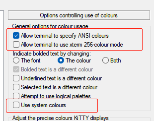
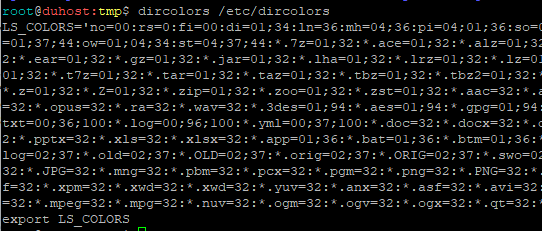

# ls 颜色设置和展示

哎，这么基础的设置，我也折腾了好一阵子！关于ls和颜色设置的一些基础知识，我都知道，但就是没设置出自己想要的效果！ 

ls要达到自己想要的效果，粗浅的经验，要以下几个方面的配合：

- ls 命令，通过alias设置，给ls默认启用颜色显示：`alias ls='ls -h --color'`；

- 给`LS_COLORS`环境变量，默认设置成自己需要的配色方案。这个我用`dircolor`配合，不用也行，直接export LS_COLORS 也是可以的。

- 最最重要也是最经被忽略的一点：我们平时使用的ssh客户端上的显示，要改为使用真正终端上的配色，而不是ssh客户端自身的！至于在哪里修改这项配置，每种ssh客户端不一样。我用的putty，要如下配置。重点是画了红框的三个项目，一定要如图设置。

  

dircolors 这个命令本身吧，我感觉也并不能直接设置 LS_COLORS。它只是从一个配置表（dircolors文件），拼接产生一个LS_COLOR值，然后`export LS_COLORS` 。



但这些，都只是纯纯的两行字符串而已！然后拿到这些个字符串之后，还得执行才能生效。所以这个命令的用法往往是：eval \`dircolors ~/.dircolors\` 。

这样就和以下语句效果一样了。
```bash
export LS_COLORS='no=00:rs=0:fi=00:di=01;34:ln=36:mh=04;36:pi=04;01;36:so=04;33:do=04;01;36:bd=01;33:cd=33:or=31:mi=01;37;41:ex=01;36:su=01;04;37:sg=01;04;37:ca=01;37:tw=01;37;44:ow=01;04;34:st=04;37;44:*.7z=01;32:*.ace=01;32:*.alz=01;32:*.arc=01;32:*.arj=01;32:*.bz=01;32:*.bz2=01;32:*.cab=01;32:*.cpio=01;32:*.deb=01;32:*.dz=01;32:*.ear=01;32:*.gz=01;32:*.jar=01;32:*.lha=01;32:*.lrz=01;32:*.lz=01;32:*.lz4=01;32:*.lzh=01;32:*.lzma=01;32:*.lzo=01;32:*.rar=01;32:*.rpm=01;32:*.rz=01;32:*.sar=01;32:*.t7z=01;32:*.tar=01;32:*.taz=01;32:*.tbz=01;32:*.tbz2=01;32:*.tgz=01;32:*.tlz=01;32:*.txz=01;32:*.tz=01;32:*.tzo=01;32:*.tzst=01;32:*.war=01;32:*.xz=01;32:*.z=01;32:*.Z=01;32:*.zip=01;32:*.zoo=01;32:*.zst=01;32:*.aac=32:*.au=32:*.flac=32:*.m4a=32:*.mid=32:*.midi=32:*.mka=32:*.mp3=32:*.mpa=32:*.mpeg=32:*.mpg=32:*.ogg=32:*.opus=32:*.ra=32:*.wav=32:*.3des=01;94:*.aes=01;94:*.gpg=01;94:*.pgp=01;94:*.c=01;95:*.h=01;95:*.py=01;95:*.go=01;95:*.php=01;33:*.js=01;33:*.md=00;36;100:*.txt=00;36;100:*.log=00;96;100:*.yml=00;37;100:*.doc=32:*.docx=32:*.dot=32:*.odg=32:*.odp=32:*.ods=32:*.odt=32:*.otg=32:*.otp=32:*.ots=32:*.ott=32:*.pdf=32:*.ppt=32:*.pptx=32:*.xls=32:*.xlsx=32:*.app=01;36:*.bat=01;36:*.btm=01;36:*.cmd=01;36:*.com=01;36:*.exe=01;36:*.reg=01;36:*~=02;37:*.bak=02;37:*.BAK=02;37:*.log=02;37:*.log=02;37:*.old=02;37:*.OLD=02;37:*.orig=02;37:*.ORIG=02;37:*.swo=02;37:*.swp=02;37:*.bmp=32:*.cgm=32:*.dl=32:*.dvi=32:*.emf=32:*.eps=32:*.gif=32:*.jpeg=32:*.jpg=32:*.JPG=32:*.mng=32:*.pbm=32:*.pcx=32:*.pgm=32:*.png=32:*.PNG=32:*.ppm=32:*.pps=32:*.ppsx=32:*.ps=32:*.svg=32:*.svgz=32:*.tga=32:*.tif=32:*.tiff=32:*.xbm=32:*.xcf=32:*.xpm=32:*.xwd=32:*.xwd=32:*.yuv=32:*.anx=32:*.asf=32:*.avi=32:*.axv=32:*.flc=32:*.fli=32:*.flv=32:*.gl=32:*.m2v=32:*.m4v=32:*.mkv=32:*.mov=32:*.MOV=32:*.mp4=32:*.mpeg=32:*.mpg=32:*.nuv=32:*.ogm=32:*.ogv=32:*.ogx=32:*.qt=32:*.rm=32:*.rmvb=32:*.swf=32:*.vob=32:*.webm=32:*.wmv=32:'
```
