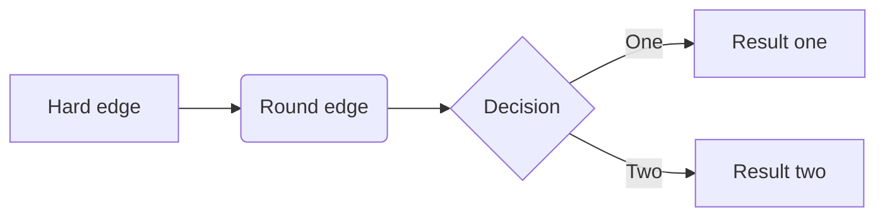
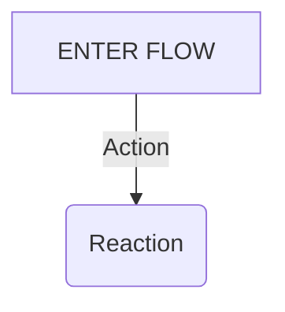

https://support.typoraio.cn/Draw-Diagrams-With-Markdown/
http://mermaid-js.github.io/mermaid/#/

```flow
st=>start: Start
op=>operation: Your Operation
cond=>condition: Yes or No?
e=>end

st->op->cond
cond(yes)->e
cond(no)->op
```
从左到右


